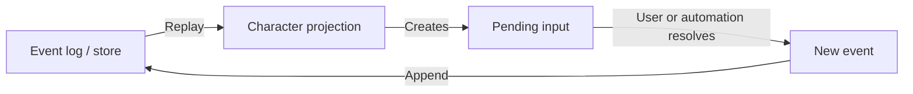

# Character Creation Architecture Concepts

This document describes the implementation-facing architecture concepts used
to model Traveller character creation. It is separate from
`character-creation.md`, which describes the rules model.

## Layers

Character creation is structured in four layers. Each layer may only import
from the layers below it; clients never reach past the service layer into the
domain or mechanism.

```text
clients (web app, approval tests, CLI, ...)
    ↓ import only
service  (CharacterService — orchestration and presentation)
    ↓ import only
domain   (career rules, character state, projection implementation)
    ↓ import only
mechanism  (event_base, pending_input, store, replay)
```

`ceres.character.app` is the composition point that wires domain types into
the mechanism layer (injecting `register_event_handlers` and
`CharacterSummary.model_validate_json` into the store).

## Event-Sourced Projection

Character creation is represented as an event-sourced process:



The event log records what happened. Replaying the log produces the current
projection: characteristics, skills, careers, terms, benefits, pending choices,
and final summary.

## Events

Events are immutable records of facts or decisions: a character started, a UCP
was rolled, a career was entered, a survival roll happened, a term event was
resolved, a skill was chosen, a benefit was taken.

Events should not be treated as UI commands. They are historical facts appended
after validation.

## Projection

The projection is the current state derived from replaying events. It is the
answer to "where is this Traveller right now in creation?" The projection may
contain both a summary suitable for display and richer in-progress state needed
to continue creation correctly.

## Pending Input

Pending inputs are contracts between domain logic and a client. They represent
choices or rolls that must be supplied before creation can continue: choose a
skill table, choose a speciality, roll survival, select a homeworld, decide
whether to reenlist, resolve an injury, and so on.

A pending input should expose structured options, not arbitrary strings whose
meaning the UI has to guess. The domain owns the rules; the UI presents the
contract.

## Pending Input Ordering

`pending_inputs` is an ordered list. The front of the list is what the UI
presents next. Order is controlled entirely by two insertion modes:

- **`append(item)`** — schedule something for *later*, after all currently
  pending items. Use this for future phases: survival after training, term event
  after survival, advancement after term event, reenlistment after the skill
  roll.

- **`insert(0, item)`** — schedule something *immediately*, before all currently
  pending items. Use this for sub-steps of the current operation that must
  complete before anything already in the queue: a specialisation choice that
  arises when a skill-table roll lands on an unspecialised skill, or additional
  choices generated during an event resolution.

No other positioning logic is needed. In particular, there is no need to scan
the queue for a specific pending type and insert before it. `insert(0)` is
always correct for immediate work; `append` is always correct for deferred work.

`pending_id = (event.id, ix)` is a lookup key only. `ix` distinguishes multiple
pending inputs created by the same event; it has no relationship to list
position. When an event arrives, `fulfill_pending` finds the matching item by
equality scan, not by index.

`blocking` is a consistency guard on replay, not an ordering mechanism. A
non-fulfilling event (one with `fulfills=None`) arriving while a `blocking=True`
pending exists indicates a broken event log and raises `ReplayError`. It does
not influence the sequence in which pending inputs are presented or fulfilled.

## Creation Ordering: Homeworld Before Sophont

Homeworld selection is the first pending input after a character record is
created, before sophont selection and before UCP. This ordering is a deliberate
constraint:

- Background skills depend on the homeworld's UWP.
- Available sophonts and precareer eligibility may depend on homeworld.
- Because homeworld is always selected first, `birthworld` equals `homeworld`
  by definition at the point of creation — no separate stored field is needed.

The initial event carries only `name` and `player`; homeworld and sophont
arrive as the first two pending inputs in the wizard.

## Store

The store appends events and reloads event streams. It should preserve history,
allow replay, and store derived summaries only as cached projections of the
event log.

## Service Layer

`CharacterService` is the façade that all clients use. It owns a store,
the career/precareer catalogues, and all orchestration logic. No client imports
from `ceres.character.domain.*` or `ceres.character.mechanism.*` directly.

The service returns presentation-ready types (`CharacterView`, `SubmitResult`,
`CharacterListItem`) rather than raw projections or domain objects. This keeps
the web layer and tests free of domain coupling.

Unit tests for the domain and mechanism layers are the explicit exception: they
test those layers directly by design.

## Domain Responsibility

Rules belong with the domain that understands them.

- Career modules should understand their own career tables, ranks, assignment
  changes, events, mishaps, and mustering-out rules.
- Pre-career modules should understand their own entry, graduation, events, and
  consequences.
- Sophont/homeworld rules should be represented as origin rules that can affect
  characteristics, starting age, background skills, available paths, traits,
  and later choices.
- Generic replay should be a courier of events and pending inputs, not a hidden
  Traveller rules engine.

This separation matters because Traveller character creation is not one fixed
flow. Alien sophonts, optional Companion rules, psionics, alternate careers,
and cultural variants all change the rule surface.
