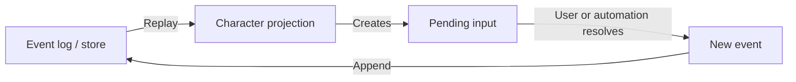

# Character Creation Architecture Concepts

This document describes the implementation-facing architecture concepts used
to model Traveller character creation. It is separate from
`character-creation.md`, which describes the rules model.

## Event-Sourced Projection

Character creation is represented as an event-sourced process:

The event log records what happened. Replaying the log produces the current
projection: characteristics, skills, careers, terms, benefits, pending choices,
and final summary.

## Events

Events are immutable records of facts or decisions: a character started, a UCP
was rolled, a career was entered, a survival roll happened, a term event was
resolved, a skill was chosen, a benefit was taken.

Events should not be treated as UI commands. They are historical facts appended
after validation.

## Projection

The projection is the current state derived from replaying events. It is the
answer to “where is this Traveller right now in creation?” The projection may
contain both a summary suitable for display and richer in-progress state needed
to continue creation correctly.

## Pending Input

Pending inputs are contracts between domain logic and a client. They represent
choices or rolls that must be supplied before creation can continue: choose a
skill table, choose a speciality, roll survival, select a homeworld, decide
whether to reenlist, resolve an injury, and so on.

A pending input should expose structured options, not arbitrary strings whose
meaning the UI has to guess. The domain owns the rules; the UI presents the
contract.

## Store

The store appends events and reloads event streams. It should preserve history,
allow replay, and store derived summaries only as cached projections of the
event log.

## Domain Responsibility

Rules belong with the domain that understands them.

- Career modules should understand their own career tables, ranks, assignment
  changes, events, mishaps, and mustering-out rules.
- Pre-career modules should understand their own entry, graduation, events, and
  consequences.
- Sophont/homeworld rules should be represented as origin rules that can affect
  characteristics, starting age, background skills, available paths, traits,
  and later choices.
- Generic replay should be a courier of events and pending inputs, not a hidden
  Traveller rules engine.

This separation matters because Traveller character creation is not one fixed
flow. Alien sophonts, optional Companion rules, psionics, alternate careers,
and cultural variants all change the rule surface.
