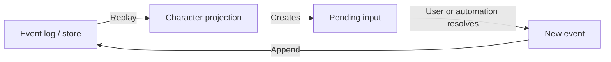

# Character Creation Architecture Concepts

This document describes the implementation-facing architecture concepts used
to model Traveller character creation. It is separate from
`character-creation.md`, which describes the rules model.

## Layers

Character creation is structured in four layers. Each layer may only import
from the layers below it; clients never reach past the service layer into the
domain or mechanism.

```text
clients (web app, approval tests, CLI, ...)
    ↓ import only
service  (CharacterService — orchestration and presentation)
    ↓ import only
domain   (career rules, character state, projection implementation)
    ↓ import only
mechanism  (event_base, pending_input, store, replay)
```

`ceres.character.app` is the composition point that wires domain types into
the mechanism layer (injecting `register_event_handlers` and
`CharacterSummary.model_validate_json` into the store).

## Event-Sourced Projection

Character creation is represented as an event-sourced process:


```mermaid
graph LR
    A[Event log / store] -->|Replay| B[Character projection]
    B -->|Creates| C[Pending input]
    C -->|User or automation resolves| D[New event]
    D -->|Append| A
```

The event log records what happened. Replaying the log produces the current
projection: characteristics, skills, careers, terms, benefits, pending choices,
and final summary.

## Events

Events are immutable records of facts or decisions: a character started, a UCP
was rolled, a career was entered, a survival roll happened, a term event was
resolved, a skill was chosen, a benefit was taken.

Events should not be treated as UI commands. They are historical facts appended
after validation.

## Projection

The projection is the current state derived from replaying events. It is the
answer to "where is this Traveller right now in creation?" The projection may
contain both a summary suitable for display and richer in-progress state needed
to continue creation correctly.

## Pending Input

Pending inputs are contracts between domain logic and a client. They represent
choices or rolls that must be supplied before creation can continue: choose a
skill table, choose a speciality, roll survival, select a homeworld, decide
whether to reenlist, resolve an injury, and so on.

A pending input should expose structured options, not arbitrary strings whose
meaning the UI has to guess. The domain owns the rules; the UI presents the
contract.

## Pending Input Ordering

`pending_inputs` is an ordered sequence (exposed as a read-only tuple). The
front is what the UI presents next. Order is controlled through queue methods
on `CharacterProjection`:

- **`queue_deferred(item, ...)`** — schedule something for *later*, after all
  currently pending items. Use this for future phases: survival after training,
  term event after survival, advancement after term event, reenlistment after
  the skill roll.

- **`queue_immediate(item, ...)`** — schedule something *immediately*, before
  all currently pending items. Use this for sub-steps of the current operation
  that must complete before anything already in the queue: a specialisation
  choice that arises when a skill-table roll lands on an unspecialised skill,
  or additional choices generated during an event resolution.

- **`cancel_pending(*types)`** — remove all pending inputs that are instances
  of the given types (e.g. purging career-phase pendings when a mishap ejects
  the character mid-term).

- **`insert_before_type(item, *types)`** — insert one pending input immediately
  before the first pending of the given types, or at the end if none found. Use
  this for items that must precede a specific phase but cannot use
  `queue_immediate` because other items already sit in front (e.g. a homeworld
  change offered before survival, after a scout term starts).

Both `queue_immediate` and `queue_deferred` accept multiple arguments and
preserve caller order. No other positioning logic is needed.

`pending_id = (event.id, ix)` is a lookup key only. `ix` distinguishes multiple
pending inputs created by the same event; it has no relationship to list
position. When an event arrives, `fulfill_pending` finds the matching item by
equality scan, not by index.

`blocking` is a consistency guard on replay, not an ordering mechanism. A
non-fulfilling event (one with `fulfills=None`) arriving while a `blocking=True`
pending exists indicates a broken event log and raises `ReplayError`. It does
not influence the sequence in which pending inputs are presented or fulfilled.

## Creation Ordering: Homeworld Before Sophont

Homeworld selection is the first pending input after a character record is
created, before sophont selection and before UCP. This ordering is a deliberate
constraint:

- Background skills depend on the homeworld's UWP.
- Available sophonts and precareer eligibility may depend on homeworld.
- Because homeworld is always selected first, `birthworld` equals `homeworld`
  by definition at the point of creation — no separate stored field is needed.

The initial event carries only `name` and `player`; homeworld and sophont
arrive as the first two pending inputs in the wizard.

## Store

The store appends events and reloads event streams. It should preserve history,
allow replay, and store derived summaries only as cached projections of the
event log.

## Service Layer

`CharacterService` is the façade that all clients use. It owns a store,
the career/precareer catalogues, and all orchestration logic. No client imports
from `ceres.character.domain.*` or `ceres.character.mechanism.*` directly.

The service returns presentation-ready types (`CharacterView`, `SubmitResult`,
`CharacterListItem`) rather than raw projections or domain objects. This keeps
the web layer and tests free of domain coupling.

Unit tests for the domain and mechanism layers are the explicit exception: they
test those layers directly by design.

## Domain Responsibility

Rules belong with the domain that understands them.

- Career modules should understand their own career tables, ranks, assignment
  changes, events, mishaps, and mustering-out rules.
- Pre-career modules should understand their own entry, graduation, events, and
  consequences.
- Sophont/homeworld rules should be represented as origin rules that can affect
  characteristics, starting age, background skills, available paths, traits,
  and later choices.
- Generic replay should be a courier of events and pending inputs, not a hidden
  Traveller rules engine.

This separation matters because Traveller character creation is not one fixed
flow. Alien sophonts, optional Companion rules, psionics, alternate careers,
and cultural variants all change the rule surface.

## Agreed Web UI Direction

Design decisions agreed on 2026-09-13. The Svelte character interface is now
available at `/characters`, alongside rounds. Implementation and follow-up work
are tracked in [issue #63](https://github.com/magnus-lycka/ceres/issues/63).

Build and run the shared interface:

```bash
npm --prefix web run build
uv run uvicorn ceres.character.web.app:app --reload --port 1105
```

Open `http://localhost:1105/characters`. The previous server-rendered interface
remains available at `/ui`.

- Character creation joins the existing Svelte application used by rounds.
  Shared navigation and appearance establish a uniform Ceres web interface;
  moving other domains into that interface is separate work.
- FastAPI and the Python character engine remain responsible for creation
  rules. The frontend presents backend-supplied choices and input descriptors,
  so new sophonts and careers using supported input kinds require no frontend
  changes. A genuinely new interaction kind may require a new renderer.
- Retain the existing creation rules and choices while redesigning the screen
  around the current decision, a visible character summary, and accessible
  creation history.
- Finished characters can be added to the rounds actor library as linked
  actors. An explicit "Update from character" action refreshes an actor;
  character changes never propagate silently. Combat injuries remain separate
  from creation history.
- Transfer the character's name and physical characteristics to the actor,
  together with a link to its full character sheet. Skills, careers and
  biography remain on the character sheet. Refresh preserves actor notes,
  tags and injuries.
- Each rounds library has at most one linked actor per source character.
  Adding the same character again opens the existing actor. Character refresh
  is blocked while the actor participates in an active situation.
- Character creation is one optional origin for rounds actors, including
  generic NPCs. Actors created directly in rounds or obtained from other
  sources remain supported and do not require a character record.
- Copying an actor in rounds produces an independent, editable actor with no
  source-character link, character-sheet link, or character-refresh behaviour.
  Copies are not subject to the one-linked-actor-per-character restriction;
  a generic NPC can therefore supply multiple independent actors for play.
- Deleting the source character retains the linked actor and all its data.
  After the backend confirms deletion, show "Source character deleted" and
  disable refresh. Temporary backend unavailability shows "Source unavailable"
  instead; it is not evidence of deletion.
- Character creation continues to persist on the Python server. Rounds keeps
  browser storage and GitHub sync; unified persistence is outside this rewrite.
- Preserve world selection and filters, undo, character listing and deletion,
  completed sheets, and PDF download.
- Design primarily for desktop and tablet, with a usable stacked phone layout.
  On narrow screens the current decision takes priority; summary and history
  remain accessible.
- The normal launch serves the built Svelte application and character API
  through FastAPI at one address. Preserve standalone rounds operation;
  when the backend is unavailable, Characters explains that it needs the server
  while rounds remains usable.
