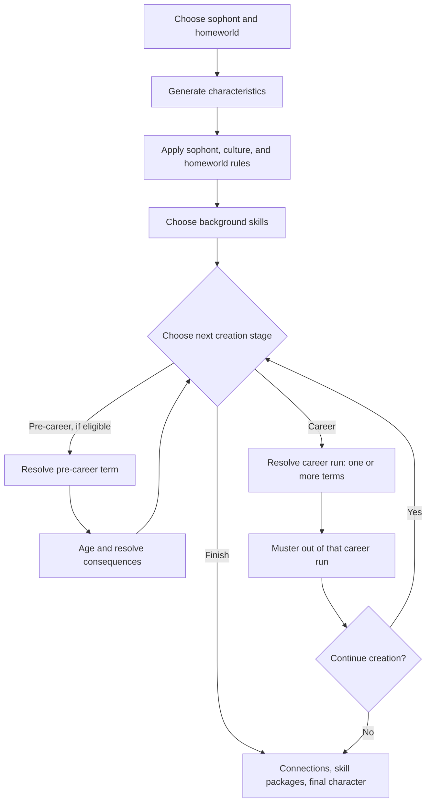
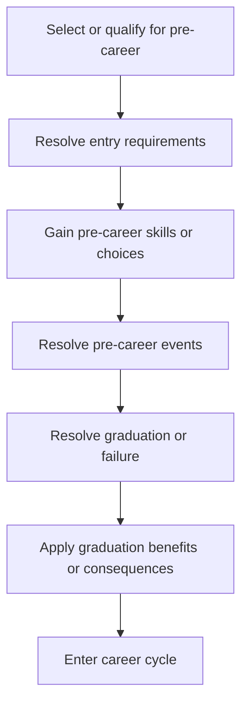
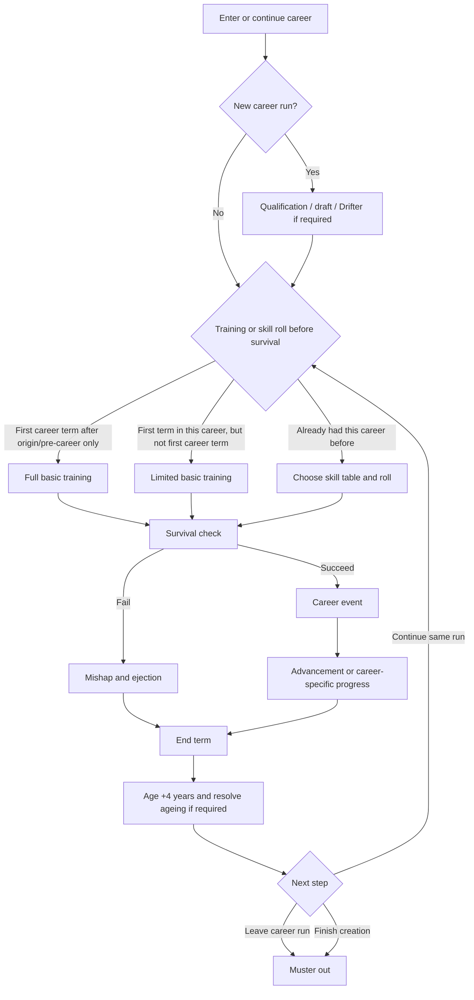

# Traveller Character Creation Concepts

This document describes Traveller character creation as a rules model. It is
not a code map. Its purpose is to name the concepts that character generation
must represent, including the places where published Traveller material varies
the default human/Core flow.

## 1. Birth, Sophont, and Homeworld

Character creation begins before a career. A Traveller first has a sophont,
homeworld, name, and the biological or cultural facts that determine how the
rest of creation works.

For default Core human creation this is simple: the Traveller starts at age 18
with the usual six characteristics, selects a homeworld, receives background
skills, then begins creating terms. A term may be pre-career education if it is
still available, or a normal career term.

Alien and variant-human material makes this step much more important. Sophont
choice may determine:

- characteristic modifiers, alternate rolls, minimums, caps, or entirely new
  characteristics;
- whether SOC is used normally, replaced, or supplemented by another status
  measure;
- sex, caste, social class, clan, subspecies, or other subcategories that alter
  characteristics, titles, allowed careers, or starting age;
- traits such as natural weapons, armour, unusual senses, environmental needs,
  psionic expectations, or restrictions on equipment use;
- background skills that are mandatory, unavailable, or counted differently;
- whether Imperial assumptions about draft, nobility, homeworld, education, and
  social mobility apply at all.

The homeworld is also not just colour. It can determine background skills, TL
expectations, available pre-careers, eligibility for psionic testing or training,
access to bases or institutions, cultural career restrictions, and later
relocation opportunities.

Examples from alien material:

- Aslan in the Hierate use gender and clan heavily; males have Territory (TER),
  and starting age differs from humans.
- Vargr from the Extents use Charisma (CHA) instead of SOC.
- Za'tachk use Boldness (BOL), have sex-based starting ages, and have career
  access limited by sex.
- Hivers, Droyne, Dolphins, Orca, Bwaps, Virushi, and many JTAS aliens show
  that body plan, culture, and psychology can alter skills, equipment,
  benefits, ageing, career availability, or the term structure itself.

## 2. Characteristics and Profiles

The default Universal Character Profile (UCP) contains six characteristics:

- STR: Strength
- DEX: Dexterity
- END: Endurance
- INT: Intellect
- EDU: Education
- SOC: Social Standing

In text, the UCP is written as six ehex digits. For example, `77A89C`
corresponds to STR 7, DEX 7, END 10, INT 8, EDU 9, SOC 12.

This six-character UCP is the human default, not the whole concept. Traveller
also uses characteristics outside the default UCP, including PSI and alien
characteristics such as CHA, TER, or BOL. Some sophonts replace SOC, reinterpret
SOC, add a status characteristic, or tie status to family, sex, caste, clan, or
career.

Conceptually, character creation needs a characteristic profile rather than a
hard-coded assumption that every Traveller has exactly the same six meaningful
values.

## 3. Skills, Specialities, and Broad Skills

Traveller skills may be general or specialised.

- Skill 0 means basic competence: the Traveller avoids the unskilled DM-3
  penalty but receives no positive DM.
- Skill 1+ is added directly to relevant checks.
- Some skills have specialities. When a Traveller gains level 1 in such a skill,
  they choose a speciality.
- Later gains in the same skill can either increase an existing speciality or
  open another speciality at level 1. Opening another speciality costs the same
  kind of skill gain as increasing a level or opening a different skill.
- A speciality at level 1+ normally grants the parent skill at level 0, allowing
  related checks without the unskilled penalty.

The Traveller Companion broad skill rules make this more nuanced. Broad skills
such as Art, Profession, and Science can have specialities and
sub-specialities. A sub-speciality may grant level 0 within a related group but
not across the entire broad skill. Profession is especially broad: having one
profession does not imply competence in every other profession.

Some sophonts also modify skills directly. They may gain mandatory background
skills, be unable to acquire particular skills, convert certain skill results,
or treat some skills as inherently easier or harder.

## 4. General Birth-to-Finish Flow

At the highest level, Traveller creation is a sequence of life stages:

This chart is intentionally broad. It is not the sequence for every term. It
marks the major responsibilities: origin, early life, pre-career education,
career runs, ageing/injury, mustering out, and final group-facing steps. A
career run contains one or more terms in the same benefit/rank run. Mustering
out happens when that career run ends, not only at the end of character
creation. A character can therefore muster out more than once before final
review.

For Core pre-career education, university and military academy usually occur in
the first term, in place of a career, but can be delayed until the second or
third term if the Traveller spends one or two terms in a career first. From the
fourth term onward, Core pre-career education is no longer available.

Sophont and culture can alter almost every box. Some species begin earlier or
later than age 18. Some receive different background skills. Some cannot use
the draft. Some have pre-career rites or education that are not equivalent to
human university or academy. Some do not use the standard career cycle at all.

## 5. Pre-Career Flow

Pre-careers represent education, upbringing, academy training, or unusual early
life outside the normal career loop. Despite the name, Core pre-career education
does not have to be the Traveller's first term; it can be delayed until the
third term.

Pre-careers are not all the same. University, military academy, psionic
community, colonial upbringing, species-specific rites, and cultural education
can all use different entry requirements, skill choices, events, and outcomes.

Some pre-careers are only available to particular sophonts, cultures,
homeworlds, or social categories. Others may be automatic if a homeworld or
upbringing condition applies.

## 6. Typical Career Term Flow

A typical career term, such as a straightforward Scout term, looks like this:

Important details:

- A career term normally lasts four years.
- Full basic training applies only in the Traveller's first career term after
  origin and any pre-career education. It grants the career's basic training
  package, usually six level 0 skills.
- Limited basic training applies when the Traveller enters a career for the
  first time but has already had at least one previous career term. It grants
  one level 0 skill from the career's service skills table or equivalent.
- If the Traveller has already had a term in that career before, they are not
  eligible for basic training in it again. They choose a skill table and roll
  on it, whether this is a later term in the same run or a later return to the
  same career after doing something else.
- Ageing still happens when the Traveller leaves or musters out; it is tied to
  completing the term, not only to continuing.
- Survival failure usually causes a mishap and ejection, and the failed term
  normally does not grant a benefit roll.
- Career events can interrupt or redirect the normal flow: they may force
  ejection, forbid reenlistment, grant automatic advancement, create a pending
  choice, alter later rolls, trigger injuries, create enemies/allies, or open
  new careers.
- Continuing in the same career run is different from entering a new career.
  It should not be represented as re-applying for the same career.

## 7. Career Flow Variants

The standard term flow is a useful baseline, but several variants matter.

### Commissioned Careers

Military careers can include a commission step. A commission may change the
rank track and can replace or bypass normal advancement for that term. The
career term flow should treat commission as a career-specific rank process, not
as a universal step for all careers.

### Assignment Changes

Changing assignment is not uniform.

In some careers, changing assignment is still continuing the same career run.
The Traveller keeps rank and does not muster out merely because the assignment
changed.

In other careers, changing assignment is treated as starting a new career. The
old career run must be closed, benefits are resolved, and the new assignment
starts at rank 0 after qualification.

### Draft and Drifter

The draft is an alternative after a failed qualification only if the Traveller
has not already used it and if the sophont or culture uses the draft. Some
societies do not use the draft at all. If no draft is available, failed
qualification may force Drifter, Rogue, another fallback career, or a
species-specific equivalent.

### Non-Standard Career Models

Some alien societies replace the normal career loop. A species or culture may
have fixed numbers of terms, no survival checks, no rank system, no mustering
out benefits, mandatory careers, caste-based careers, or lifelong service.

These should be understood as first-class character creation models, not as
exceptions hacked onto human career terms.

### Prisoner

The Prisoner career is also structurally deviant. It is usually entered because
something happened to the Traveller rather than because they freely chose a
normal career path. A prison term represents incarceration, survival inside the
prison system, possible parole or escape, and the consequences of a criminal
record.

Prisoner therefore needs to be treated as a special career model: entry,
continuation, ejection, mustering out, benefits, and available next steps do not
carry exactly the same meaning as they do for ordinary careers.

## 8. Mustering Out and Benefits

When a Traveller leaves a career run, they muster out and receive benefits.

- A career run is the span of terms that count together for benefits, rank, and
  pension.
- The Traveller usually receives one benefit roll per eligible term, plus
  career-specific or rank-based extra rolls.
- Cash rolls are limited across the Traveller's whole lifetime.
- Some careers or species do not receive pensions.
- Some sophonts reinterpret or replace benefits. Armour, weapons, money,
  passage, ship shares, titles, or equipment may not mean the same thing for
  every species.

For assignment-changing careers where a new assignment counts as a new career,
mustering out happens before the new assignment begins.

## 9. Ageing, Injury, and Medical Consequences

For default human Core creation, ageing begins after the fourth term, when the
Traveller reaches age 34. Ageing is rolled at the end of every later term.

The default ageing roll is based on total terms served, but sophonts can change
starting age, ageing rate, lifespan, or ageing DMs. Some species age faster or
slower than humans. Others start careers much earlier or later.

Injuries can come from mishaps, events, ageing crises, or other rules. Medical
care may restore lost characteristic points at a cost, sometimes with employer
coverage. If ageing or injury reduces a characteristic to 0, character creation
must resolve the resulting crisis rather than treating it as an ordinary
numeric adjustment.

## 10. Events, Mishaps, Life Events, and Outcomes

Pre-career events, career events, mishaps, and life events are where much of the
Traveller's biography becomes concrete. They are not merely narrative text:
they can change the character, redirect the flow, or create lasting obligations
and relationships.

Common outcome types include:

- skill gains, skill choices, broad-skill or speciality choices, and psionic
  talent changes;
- characteristic increases, decreases, injuries, ageing crises, medical debt,
  or other health consequences;
- immediate flow changes such as ejection, forced career exit, forbidden
  reenlistment, automatic qualification, automatic advancement, prison, draft,
  or access to otherwise unavailable careers;
- deferred modifiers such as DMs to future qualification, survival,
  advancement, commission, or benefit rolls;
- additional or lost benefit rolls, restrictions on benefit rolls, ship shares,
  cash, pensions, debt, equipment, weapons, armour, passages, or other material
  outcomes;
- social outcomes such as titles, rank changes, status changes, enemies,
  rivals, contacts, allies, patrons, dependants, family obligations, or criminal
  records;
- homeworld or relocation consequences, including forced or optional movement
  to another world;
- narrative facts that should remain visible because they explain later rules
  or character state.

Relationship outcomes have different meanings:

- **Contact**: someone useful who can provide information, services, or access,
  but whose loyalty is limited.
- **Ally**: someone personally loyal or strongly favourable to the Traveller,
  usually more willing to take risks or spend resources on their behalf.
- **Rival**: someone who competes with, resents, or obstructs the Traveller but
  is not necessarily committed to harming them.
- **Enemy**: someone actively hostile who may endanger the Traveller, their
  reputation, career, resources, or associates.

These relationships may be individual people, organisations, family members,
institutions, or other Travellers. Some events create them directly; others ask
the player or referee to define who was involved.

## 11. Connections, Skill Packages, and Finalisation

After individual generation, group-facing rules may apply:

- The Connections rule lets Travellers connect events and gain limited extra
  skill levels.
- Skill packages help ensure the final group can cover essential roles.
- Final character review collects and reconciles the outcomes already produced
  by the term loops and event resolution: debt, pension, benefits, allies,
  contacts, rivals, enemies, ship shares, titles, psionic state, homeworld,
  current homeworld, injuries, obligations, and other lasting consequences.

These steps are part of character generation, but they are not the same as the
career term loop.
