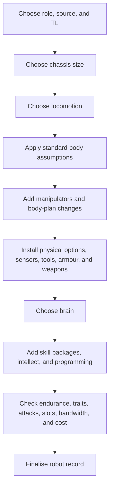

# Traveller Robot Creation

This document describes the Traveller robot-creation concept space at the rule
and design level. It is not a statement that the current Ceres implementation
already follows this structure.

## 1. Purpose and Scale

Robot creation produces an artificial actor, tool, vehicle-like platform, or
synthetic servant. It is closer to equipment design than character creation, but
robots can overlap with characters when androids, avatars, self-aware machines,
or robots as Travellers are in scope.

A robot design should answer these questions:

- What task or role is the robot built for?
- What tech level and source rules apply?
- What body size and locomotion does it use?
- What manipulators, options, tools, weapons, and sensors does it carry?
- What kind of brain controls it?
- What skills, packages, bandwidth, and programming does it have?
- How much does it cost, how durable is it, and how long can it operate?

## 2. Core Resource Budgets

Robot design is built around several linked budgets:

- **Size**: the chassis scale, which affects slots, hits, cost, traits, and what
  components can be installed.
- **Slots**: physical installation space for locomotion, options, manipulators,
  weapons, armour, tools, and other components.
- **Zero-slot capacity**: small sensory or communications options may consume no
  normal slots but still have a limit.
- **Cost**: chassis, locomotion, brain, options, skill packages, weapons, and
  final adjustments.
- **Tech level**: both the robot's design TL and the minimum TL of individual
  components.
- **Brain capability**: INT, bandwidth, software limits, autonomy, and what
  skill packages can be supported.
- **Endurance**: operating time, power source, and recharge or refuel
  assumptions.
- **Traits and hits**: durability, protection, vulnerabilities, locomotion
  traits, senses, and special capabilities.

The designer is usually balancing physical body capacity against intelligence,
skill, endurance, and cost.

## 3. Typical Design Flow

The exact order can vary, but the robot-design process is roughly:

Like ship building, robot creation is iterative. A better brain may exceed cost
or TL assumptions. A desired manipulator, weapon, or sensor suite may force a
larger chassis. A small drone may not have enough slots or endurance for the
intended role.

## 4. Chassis, Size, and Locomotion

The chassis establishes the physical envelope:

- Size and base cost.
- Slot capacity.
- Hits and durability.
- Default traits.
- Compatibility with locomotion, manipulators, armour, and options.

Locomotion determines how the robot moves and often grants traits or
limitations. Wheels, tracks, walkers, grav, flyers, swimmers, stationary
platforms, and special movement modes all imply different tactical and
operational uses.

The same role can produce very different robots depending on locomotion. A
security robot on tracks, a grav courier, and a stationary factory arm may share
some sensors or software but are different conceptual designs.

## 5. Manipulators and Body Plan

Robots commonly assume a basic head and two manipulators unless the design says
otherwise. That assumption is only a starting point.

Body-plan decisions include:

- Number and quality of manipulators.
- Fine manipulators, heavy manipulators, claws, tools, tentacles, legs, or
  non-human arrangements.
- Whether legs or other appendages also function as manipulators.
- Natural attacks or integrated weapons.
- Size limits and slot costs.

Manipulators matter because they define what the robot can physically do. A
robot with excellent software but no suitable manipulator may still be unable to
repair a drive, fire a weapon, or perform delicate medical work.

## 6. Options and Default Suite

Robot rules commonly assume a default suite of basic sensory and communication
equipment. Beyond that, options can add:

- Sensors and communications.
- Armour and protection.
- Tools, cargo capacity, and environmental systems.
- Weapons and attack systems.
- Stealth, camouflage, hardened systems, or special traits.
- Cosmetic or social features.

Some options are unique robot components. Others are ordinary gear installed on
or integrated into a robot. Conceptually, those gear-backed options should keep
their equipment identity while also participating in the robot's slot, cost, TL,
and trait calculations.

## 7. Brain, Bandwidth, and Skills

The brain is the robot's control system. It governs autonomy, intelligence,
bandwidth, skill packages, and sometimes personality or self-direction.

Important distinctions include:

- A robot brain is not just a character mind.
- Skill packages are installed capabilities, not necessarily lived experience.
- Bandwidth limits how much software or how many packages can be active or
  supported.
- Some packages may grant skill DMs, expert behaviour, or programmed routines.
- A robot may use skill names that overlap with character skills while still
  acquiring and representing them differently.

This is a place where shared vocabulary is useful but false equivalence is
dangerous. A robot using Mechanic and a Traveller learning Mechanic may share a
task interface, but the creation rules that gave them those capabilities are
not the same.

## 8. Endurance, Traits, Attacks, and Damage

Robot records need more than a parts list. They must also describe how the robot
performs in play:

- Endurance and power assumptions.
- Hits, armour, and damage handling.
- Locomotion traits and environmental limits.
- Sensor and communication traits.
- Attacks from weapons, natural weapons, or manipulators.
- Programming restrictions, obedience, autonomy, and failure modes.

These traits connect the construction process to actual use at the table.

## 9. Finalisation

Finalisation turns the design into a usable robot record:

- Name or model designation.
- Function and appearance.
- Size, TL, locomotion, endurance, hits, armour, traits, and cost.
- Manipulators, attacks, options, skills, brain, and programming.
- Any discounts, premiums, rounding, prototypes, or source-specific modifiers.
- Notes about legal restrictions, owner assumptions, or unusual rules.

The final record should be readable both as a design audit and as a play aid.

## 10. Special Robot Types and Boundary Cases

Robot creation has many special cases:

- Drones, microbots, nanorobots, and swarms.
- Androids, biological robots, clones, and synthetics.
- Avatars and remote bodies.
- Vehicle brain robots and ship brain systems.
- Robots built as Travellers or sophont-equivalent beings.
- Alien robots with different bodies, senses, social roles, or control logic.

These cases should be allowed to specialize the normal process. The ordinary
chassis-brain-options flow is a strong default, but it should not erase the
rules that make a special robot type special.

## 11. Validation

A robot design should be checked against its source rules:

- Slot use is legal.
- Zero-slot options stay within their limits.
- TL requirements are met.
- Brain bandwidth and skill-package limits are satisfied.
- Manipulators, locomotion, weapons, and options are compatible with the chassis.
- Endurance, traits, attacks, hits, armour, and cost are derived consistently.
- Special robot-type rules are applied where relevant.

As with ships, the construction record should be distinct from in-play state.
Damage, repairs, reprogramming, upgrades, ownership, and changing orders may
alter a robot after creation without changing the original design logic.
