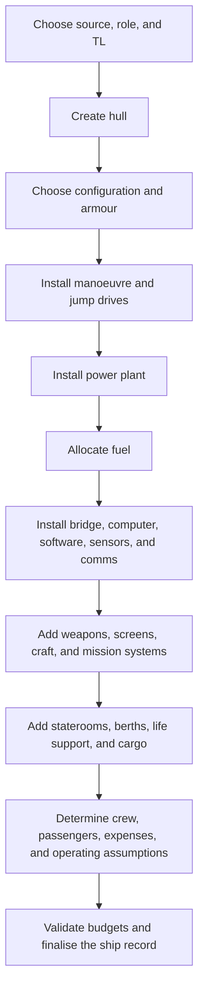

# Traveller Ship Building

This document describes the Traveller ship-building concept space at the rule
and design level. It is not a map of the current Ceres implementation, although
it should be useful when deciding where ship-building code belongs.

## 1. Purpose and Scale

Ship building creates a designed vessel: an assembly of hull, drives, power,
fuel, command systems, payload, crew space, and operational support. Unlike
character creation, it is not a life history. It is a constraint-solving process
where the designer repeatedly trades tonnage, cost, power, crew, fuel, and
mission capability.

A finished ship design should answer at least these questions:

- What is the ship for?
- Which rule source and technology assumptions apply?
- What hull and displacement does it use?
- How far and how fast can it move?
- What systems does it power, carry, and support?
- How much does it cost to buy and operate?
- What crew and passenger arrangements does it require?

## 2. Ship Identity and Constraints

Before parts are added, a ship design normally has a small amount of identity
and context:

- Name, class, role, or design description.
- Tech level and source/rule set.
- Hull size and broad category such as small craft, spacecraft, capital ship,
  station, pod, or other special case.
- Mission assumptions such as trader, scout, warship, courier, carrier,
  industrial platform, or passenger vessel.

Source identity matters. Core, High Guard, sector books, alien books, and other
supplements may give different components, costs, constraints, or construction
assumptions. A conceptually clean design keeps those rule-source choices visible
instead of silently merging them into one anonymous catalogue.

## 3. Core Resource Budgets

Most ship-design decisions affect one or more budgets:

- **Tonnage**: hull displacement consumed by drives, fuel, weapons, cargo,
  staterooms, vehicles, and special systems.
- **Cost**: purchase cost and sometimes maintenance, salaries, mortgage, and
  other operating expenses.
- **Power**: generated by the power plant and consumed by basic systems,
  manoeuvre, weapons, screens, sensors, and special systems.
- **Fuel**: jump fuel, power-plant endurance, reaction mass where relevant, and
  fuel-processing assumptions.
- **Crew and occupants**: minimum operating crew, specialists, passengers,
  troops, low berths, and accommodations.
- **Computer and software capacity**: ship computer capability and the software
  required for jump, fire control, automation, expert systems, or other tasks.
- **Hardpoints and mounts**: weapon installation capacity and restrictions.
- **Notes and exceptions**: source-specific rules, discounts, prototype rules,
  refits, alien technology, or non-standard assumptions.

These budgets are not independent. A more capable drive may demand more power,
more fuel, more cost, and less cargo. A higher automation level may reduce crew
but require better computers, software, and power.

## 4. Typical Design Flow

The exact order may vary, but the Core construction sequence is roughly:

The flow is best understood as iterative. Discovering that a design is short on
power, fuel, or tonnage often sends the designer back to earlier decisions.

## 5. Hull and Structure

The hull establishes the main design envelope:

- Displacement tonnage.
- Hull configuration and streamlining.
- Hull points and structural durability.
- Armour and protection.
- Landing, atmospheric, or re-entry assumptions.
- Special cases such as dispersed structures, planetoid hulls, pods, stations,
  or very small craft.

The hull is not merely a container. It constrains drive choices, weapon
capacity, crew requirements, survivability, and what kinds of operations the
ship can perform.

## 6. Movement, Fuel, and Power

Movement systems usually include manoeuvre capability and may include jump,
reaction drives, or other source-specific propulsion. Their ratings are central
to the design because they determine both capability and budget pressure.

Fuel and power are separate but tightly linked:

- Jump capability consumes jump fuel.
- Power plants require fuel or another endurance model.
- Manoeuvre, weapons, screens, sensors, and special systems consume power.
- Fuel processing, scoops, purification plants, and tankage can strongly affect
  operational independence.

A useful ship design should make the distinction clear between installed
capability, available fuel/endurance, and in-play operational state.

## 7. Command, Computers, Sensors, and Software

Command systems include the bridge or cockpit, control stations, ship computer,
software, communications, and sensors. These are conceptually distinct but often
overlap in the rules.

Important distinctions include:

- Basic ship control versus specialist workstations.
- Computer rating versus installed software.
- Communications versus sensors, even when both use related electronics.
- Sensor quality, operator skill, and electronic warfare effects.
- Automation, expert systems, and crew-reduction assumptions.
- Countermeasures, jamming, stealth, decoys, and related defensive systems.

These systems form a contract between the physical ship design and the tasks the
crew can perform during play.

## 8. Payload and Mission Systems

Mission payload is where ships diverge most. Examples include:

- Cargo space and cargo handling.
- Passenger staterooms, barracks, low berths, medical facilities, and luxury
  accommodations.
- Weapons, turrets, bays, screens, magazines, and fire-control systems.
- Small craft, launch facilities, vehicle bays, drones, and recovery systems.
- Laboratories, workshops, mining equipment, fuel processors, survey systems,
  libraries, prisons, troops, hangars, and other specialised installations.

Payload choices should remain visible as parts of the design rather than being
buried inside a single opaque "systems" result.

## 9. Crew, Occupants, and Operations

A ship design is not complete when the tonnage balances. It also needs an
operational model:

- Minimum crew by role and system.
- Optional crew reductions from automation.
- Specialists required by weapons, craft, sensors, engineering, medicine, or
  other mission systems.
- Passenger and troop capacity.
- Stateroom, berth, life-support, and comfort assumptions.
- Salaries, maintenance, mortgage, fuel costs, berthing fees, and other
  recurring expenses where the chosen rule set requires them.

Crew and operating assumptions are part of the design because they affect
whether the vessel is practical, affordable, and playable.

## 10. Validation and Finalisation

Finalisation should verify the design against its chosen source rules:

- Tonnage is not over-allocated.
- Power generation and consumption are understood.
- Fuel and endurance are recorded.
- Costs and operating expenses are calculated.
- Required systems such as hull, bridge, computer, drives, and crew spaces are
  present where applicable.
- TL, size, hardpoint, software, and source-specific restrictions are satisfied.
- Any deliberate exceptions are documented.

The final output should be a ship record: not just a total cost, but a readable
line-by-line explanation of what the ship contains and why the derived values
come out as they do.

## 11. Variants and Boundary Cases

Ship building has many variants that should be explicit in the concept model:

- Small craft and vehicles that do not use the full spacecraft process.
- Capital ships and stations with additional scale rules.
- Pods, modules, refits, prototypes, and source-specific technology.
- Alien ships with different assumptions about crew, life support, drives, or
  interfaces.
- Ship brains, automation-heavy vessels, and ships that overlap with robot or
  vehicle design.
- Published designs that may include errata, legacy assumptions, or deliberate
  exceptions.

The common ship-building loop should support normal designs while leaving room
for these variants to supply their own rules rather than forcing every case into
one over-generalised path.
