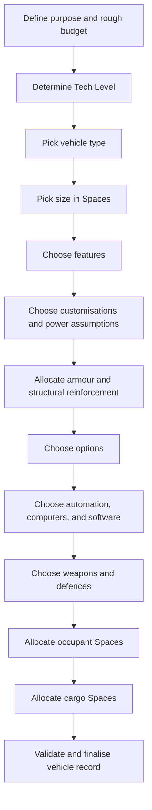

# Traveller Vehicle Building

This document describes the Traveller vehicle-building concept space at the
rule and design level, based primarily on the Core Rulebook vehicle chapter and
the Vehicle Handbook. It is not a map of the current Ceres implementation.

## 1. Purpose and Scale

Vehicle building creates a designed machine, structure, mount, platform, or
transport system. In Vehicle Handbook terms, this also covers immobile
structures such as houses, bunkers, towers, bases, and other constructed spaces
that use the same component and Space accounting. It sits between ordinary
equipment, robots, and spacecraft: small vehicles can be carried as gear or
cargo, large vehicles and structures can contain rooms, weapon systems, and
command spaces, and some vehicles can be automated or turned into drones.

A finished vehicle design should answer at least these questions:

- What is the vehicle for?
- Which Tech Level and source rules apply?
- What vehicle type and size does it use?
- How many Spaces are available and how are they allocated?
- What speed, agility, range, Hull, armour, and traits does it have?
- What cruise speed and cruise range does it normally use?
- How is it powered and controlled?
- What options, weapons, automation, crew, passengers, and cargo does it carry?
- How does it move, fight, take damage, and get repaired in play?
- How much does it cost and how practical is it to operate?

## 2. Core Resource Budgets

Vehicle Handbook design is built around **Spaces**. A Space is an abstract unit
for vehicle size and internal capacity. It avoids pretending that all vehicle
shapes can be reduced to neat real-world geometry, while still allowing a design
to account for what can be placed inside or on the vehicle.

Important budgets include:

- **Spaces**: installation capacity for occupants, cargo, options, weapons,
  power systems, customisations, armour, and other components.
- **Shipping tonnage**: spacecraft cargo, docking, hangar, launch, or recovery
  space required to transport the vehicle.
- **Cost**: base cost per Space plus features, customisations, options,
  weapons, armour, computers, automation, and final modifiers.
- **Tech Level**: availability and quality of vehicle types, features, power
  plants, options, computers, weapons, and automation.
- **Speed Band**: broad tactical and travel speed category, modified by type,
  size, features, customisations, environment, and power.
- **Cruise speed and cruise range**: ordinary operating speed and endurance,
  usually below maximum speed.
- **Range and endurance**: operating distance, fuel or power endurance, and
  environmental dependence.
- **Agility**: handling and responsiveness.
- **Hull and Protection**: structural resilience, armour by face, and damage
  tolerance.
- **Crew, passengers, and cargo**: occupied Spaces, control needs, habitability,
  and payload.

These budgets interact. A faster vehicle may lose range, a secondary power
system may consume Spaces, added armour consumes capacity and cost, and
automation may reduce crew but require computers, software, sensors, actuators,
and communications.

## 3. Core Vehicle Record

The Core Rulebook presents vehicles as things used in play, not as designs to
construct from first principles. A finished vehicle record therefore needs both
construction data and operational data.

Core vehicle records revolve around:

- Equipment and traits.
- TL.
- Operating skill.
- Agility.
- Maximum speed and cruising speed.
- Maximum range and cruising range.
- Crew and passengers.
- Cargo.
- Hull.
- Shipping tonnage.
- Cost.
- Armour by facing.
- Weapons and fire arcs.

Vehicle Handbook construction should be able to derive or explain these values.
The Core record is the play-facing result: it tells the referee and players what
the vehicle can do at the table.

## 4. Typical Design Flow

The Vehicle Handbook presents the process as a sequence, while allowing the
designer to revisit earlier steps:

The order is practical, not sacred. A desired weapon or cargo payload may force
a larger size. A power plant may constrain options. A feature may make a type
viable for the intended environment or make it impossible.

## 5. Vehicle Type

Vehicle type is mostly about locomotion and environment. The Vehicle Handbook
includes types such as:

- Aeroplane.
- Airship.
- Grav vehicle.
- Ground vehicle.
- Hovercraft.
- Rotorcraft.
- Structure.
- Submersible.
- Watercraft.
- Walker.

Each type establishes baseline characteristics such as minimum TL, controlling
skill, agility, Hull per Space, shipping tonnage, Cost per Space, traits, speed,
range, and allowed features.

Structures are included because the same construction language can build
bunkers, buildings, towers, platforms, and mobile or semi-mobile installations.
They are not vehicles in the ordinary sense, but they can share components and
construction rules.

## 6. Size and Spaces

Size is determined by Spaces. Vehicle size categories matter because they affect
baseline modifiers and allowed features:

- Small.
- Light.
- Heavy.
- Huge.
- Massive.

Spaces are not the same as spacecraft displacement tons, robot Slots, or real
world cubic metres, although the rules provide conversions for interoperability.
Those conversions are useful when vehicles are carried by ships, when spacecraft
items are installed in vehicles, or when robot-scale components are adapted to
vehicle scale.

Small items may consume no Space individually, but mounted weapons and
meaningful equipment normally need explicit accounting. There are no fractional
Spaces; rounding and aggregation rules matter.

## 7. Features

Features specialize a vehicle type. Some features apply broadly, such as Agile,
Fast, Slow, Responsive, Streamlined, or Unresponsive. Others are tied to
specific types or roles, such as AFV, STOL, Tracks, Floats, Hydrofoil, Folding
Wings, Aerodyne, or Tunneller.

Features commonly affect:

- Speed Band.
- Agility.
- Range.
- Hull.
- Armour limits.
- Shipping tonnage.
- Traits.
- Cost per Space.
- Compatibility with other features.
- Minimum size or TL.

Feature costs are generally calculated from the original base Cost per Space,
not from a recursively modified cost. This matters because multiple features
combine additively in effect and price.

## 8. Customisation and Power

Customisations are larger changes than features. They alter mobility, power,
range, alternate movement modes, and available Spaces.

Power assumptions are central:

- Low-TL vehicles may be unpowered, muscle-powered, wind-powered, or powered by
  basic engines.
- Grid, beamed, fission, fusion, Fusion+, antimatter, solar, and other systems
  can change endurance, Spaces, cost, and compatibility.
- Secondary power systems can provide backup or alternate operating modes.
- Some options require powered systems and cannot run from muscle or wind.
- Spacecraft-scale systems may require spacecraft-scale Power support.

The vehicle concept should distinguish between ordinary vehicle power,
spacecraft-scale Power, fuel/range, and tactical effects such as temporarily
reducing Speed Band to supply a high-demand system.

## 9. Armour, Hull, and Facing

Vehicles use Hull for structural resilience and Protection for armour. Armour is
allocated across six faces:

- Forward.
- Aft.
- Port.
- Starboard.
- Dorsal.
- Ventral.

Base Protection comes from TL and materials. Added armour consumes Spaces and
cost. Maximum Protection depends on TL and may be modified by traits such as
AFV. Armour can be allocated unevenly, but most faces cannot be reduced below
the base Protection level.

Structural reinforcement is distinct from armour. A reinforced hull increases
Hull; a light hull reduces it. Both affect the vehicle's fundamental resilience,
not just incoming damage from a given direction.

## 10. Movement and Environment

Core vehicles move by Speed Band rather than by metres per combat round.
Maximum speed describes the upper limit, while cruising speed is normally one
Speed Band lower and gives better range.

The operational movement model includes:

- Speed Band and Speed Band Number.
- Acceleration and deceleration by Speed Band.
- Cruise speed and increased cruise range.
- Off-road penalties and rough terrain limits for ground vehicles.
- Airborne movement limits based on the atmosphere and gravity for which the
  aircraft was designed.
- Grav vehicle freedom from normal atmosphere and world-size flight limits.
- Agility as a DM to control checks.
- Driver or pilot actions such as manoeuvre, stunt, weave, ram, dogfight, and
  evasive action.

This means the construction record cannot stop at "speed". It must expose the
values needed by the play rules: maximum, cruise, environment limits, controlling
skill, Agility, and traits that modify movement.

## 11. Options and Utility Systems

Options cover the many systems that make vehicles useful beyond locomotion:

- Controls, seats, accommodations, life support, and environmental systems.
- Sensors, communications, navigation, and transceivers.
- Cargo handling, cranes, winches, manipulators, and external utility systems.
- Medical, laboratory, industrial, survival, exploration, or luxury fittings.
- Internal and external mounts.
- Prototype, early prototype, improved, enhanced, advanced, and superior
  versions where those development stages apply.

Options should preserve their own identity. A radio, sensor, manipulator, or
medical bay is not merely anonymous consumed Space; it is a component with TL,
power, cost, usability, and task implications.

## 12. Automation, Computers, and Drones

Vehicle automation ranges from simple control assistance to remotely operated
vehicles and effectively robotic platforms.

Important distinctions include:

- Embedded vehicle computers versus larger ship computers.
- Interface software versus true autopilot.
- Fire-control systems versus autonomous weapon software.
- Drone interface, actuators, transceivers, and remote operators.
- Swarm control, battle networks, sensor operation, weaponry software, tactical
  battle systems, and point defence automation.
- Crew reduction versus full replacement of crew.

Automation is not just a cost modifier. It changes the contract between vehicle,
operator, software, sensors, communications, and task resolution.

## 13. Weapons and Defences

Vehicles can mount a broad range of weapons and protective systems:

- Archaic, direct-fire, energy, artillery, and specialised weapons.
- Ammunition bays and special ammunition.
- Turrets, mounts, gunports, remote mounts, and fire-control systems.
- Active defence and point defence.
- Spacecraft-scale weapons where the vehicle has suitable size, power, and
  source-rule permission.

Weapon design interacts with Spaces, power, computer/software support, crew,
ammunition, facing, armour, recoil, role, and legality. Military vehicle design
is therefore not just "add gun"; it is a set of linked payload and control
decisions.

## 14. Combat, Damage, and Repair

Core vehicle combat uses ordinary combat ideas but adds vehicle-specific
concerns:

- Facing matters because armour and fire arcs depend on direction.
- Closed vehicles protect occupants and limit who can fire out.
- Open vehicles expose occupants but usually allow freer firing.
- Vehicle-mounted weapons use vehicle weapon rules, ranges in kilometres, fire
  arcs, and speed-difference penalties.
- Turrets can ignore many fixed fire-arc limits.
- Light weapons are weak against vehicles; low-damage and Stun weapons give
  vehicles additional armour equal to TL.
- Large vehicles are easier to hit.
- Damage reduces Hull after armour is applied.
- Critical hits damage fuel, power plant, weapon, armour, Hull, cargo,
  occupants, drive system, or systems.
- Sustained damage can also cause critical hits.
- Collisions damage both the vehicle and what it hits, and unsecured occupants
  can be badly hurt.
- Repairs require suitable facilities, parts, time, and Mechanic checks.

Vehicle construction and vehicle play therefore meet at Hull, armour by facing,
weapons, arcs, crew exposure, systems, cargo, occupants, and repairable
components.

## 15. Occupants and Cargo

After major systems are chosen, remaining capacity is allocated to occupants and
cargo.

Occupant Spaces represent crew, passengers, operators, gunners, troops, or
other carried beings. Some vehicles need only a driver; others require pilots,
engineers, gunners, sensor operators, commanders, rowers, sailors, or remote
operators.

Cargo Spaces represent both volume and practical securing or handling capacity.
Vehicle cargo capacity can also matter when comparing vehicles with spacecraft
shipping tonnage, carried small craft, robots, containers, or deployable
systems.

## 16. Finalisation

Finalisation should produce a usable vehicle record:

- Name, model, type, TL, size, Spaces, and cost.
- Speed Band, cruise speed, agility, range, cruise range, Hull, Protection by
  face, traits, and shipping tonnage.
- Power source, endurance, fuel assumptions, and secondary power where present.
- Features, customisations, options, weapons, defences, automation, and software.
- Crew, passengers, cargo, open/closed status, fire arcs, and occupant
  assumptions.
- Notes about environmental limits, legal restrictions, source-specific rules,
  prototypes, modifications, and deliberate exceptions.

The vehicle record should be readable both as a construction audit and as a play
aid.

## 17. Variants and Boundary Cases

Vehicle building overlaps with several other design systems:

- Spacecraft can carry vehicles and can donate spacecraft-scale components.
- Robots can be vehicle-sized, and vehicles can become drones or vehicle-brain
  robots.
- Structures use vehicle construction without being ordinary vehicles.
- Biotech vehicles may be living creatures, engineered organisms, or trained
  biological platforms.
- Alien vehicles may assume different environments, body plans, senses, or
  control methods.
- Published vehicle designs may include older assumptions, errata, or special
  source rules.

The normal vehicle-building loop should support ordinary designs while allowing
these cases to provide specialized rules where the Vehicle Handbook says they
are special.

## 18. Validation

A vehicle design should be checked against its chosen source rules:

- Spaces are not over-allocated.
- Size, type, TL, feature, and customisation prerequisites are satisfied.
- Incompatible features and options are rejected.
- Cost per Space respects lower bounds and feature/customisation calculation
  rules.
- Maximum speed, cruise speed, range, cruise range, agility, Hull, shipping
  tonnage, and traits are derived consistently.
- Power-dependent options have an adequate power source.
- Spacecraft-scale systems have sufficient spacecraft-scale Power support or
  documented operating limits.
- Armour does not exceed maximum Protection and no face illegally drops below
  base Protection.
- Open/closed status, fire arcs, mounted weapons, turret assumptions, vehicle
  weapon rules, and occupant cover are represented.
- Automation, drone control, software, sensors, communications, weapons, crew,
  occupants, cargo, critical-hit locations, and repairable components are
  internally consistent.

As with ships and robots, the construction record should be distinct from
in-play state. Damage, repairs, fuel use, ammunition expenditure, cargo loading,
crew assignment, and later modifications change the vehicle in play without
changing the original design logic.
