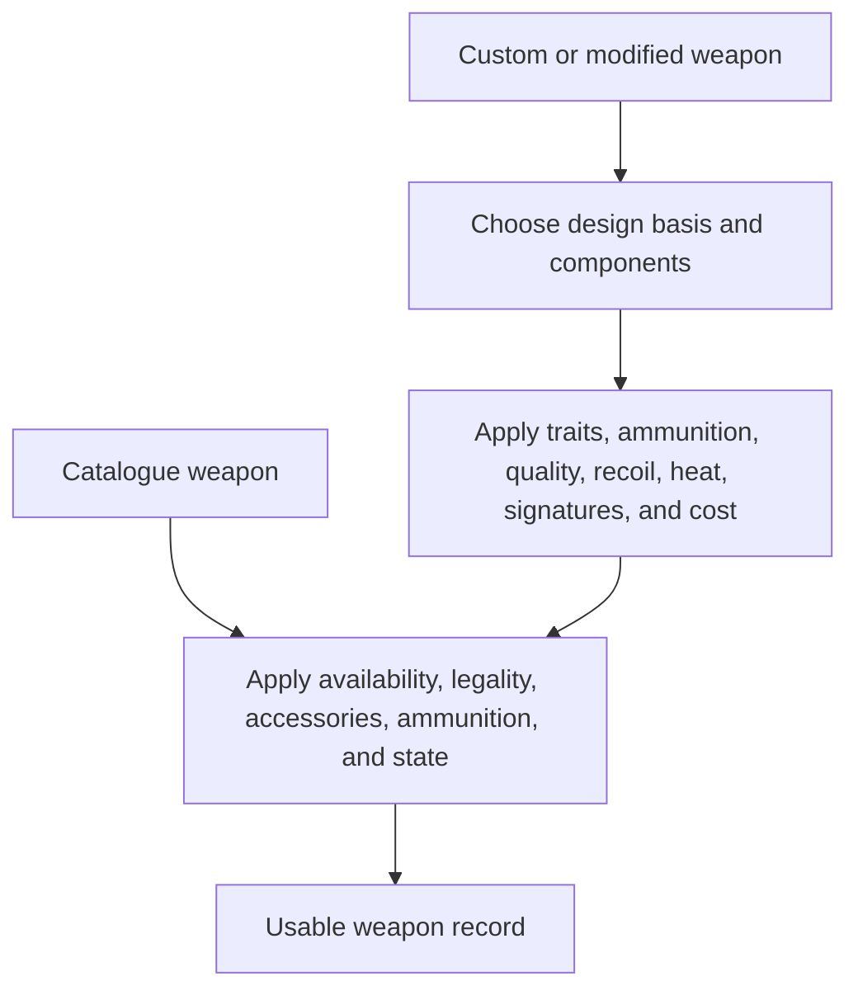

# Traveller Weapons

This document describes the Traveller weapon concept space at the rule and
design level, based primarily on Central Supply Catalogue and Field Catalogue.
It is not a map of the current Ceres implementation.

Weapons are gear, but they are a specialised enough gear family to deserve a
separate concept document. They interact with skills, range, damage, armour,
law, ammunition, mounts, power, heat, signatures, accessories, and optional
combat-detail rules.

## 1. Purpose and Scale

A weapon record should answer at least these questions:

- What kind of weapon is it?
- Which source and Tech Level define it?
- Which skill and speciality operate it?
- What range, damage, magazine, mass, cost, and traits does it have?
- What ammunition, power, heat, recoil, mount, crew, or accessories does it use?
- How does it interact with armour, cover, signatures, sensors, legality, and
  availability?
- Is it personal, support, vehicle-mounted, emplacement-mounted, or
  spacecraft-scale?

Some weapons are ordinary catalogue items. Others are custom Field Catalogue
designs whose final stats come from receiver, barrel, furniture, accessories,
ammunition, quality, and optional combat rules.

## 2. Weapon Families

Weapon categories imply different task interfaces:

- **Melee weapons**: blades, bludgeons, polearms, shock weapons, and other close
  combat tools.
- **Archaic ranged weapons**: bows, crossbows, thrown weapons, slings, and
  black-powder weapons.
- **Conventional firearms**: pistols, rifles, shotguns, submachine guns,
  automatic weapons, and support guns.
- **Energy weapons**: lasers, plasma, fusion, arc-field weapons, stunners, and
  other powered systems.
- **Gauss and advanced projectile weapons**: electromagnetic launchers,
  high-velocity darts, and advanced ammunition.
- **Grenades, explosives, mines, and demolition charges**: carried, emplaced,
  thrown, launched, or command-detonated.
- **Support and heavy weapons**: crew-served, vehicle-mounted, or installation
  weapons.
- **Artillery, missiles, rockets, and aerospace defence**: indirect fire,
  guided weapons, smart munitions, and large battlefield systems.
- **Spacecraft-scale weapons**: weapons that may appear on vehicles or
  installations only when size, power, mounting, and source rules permit it.

The family is not just flavour. It determines skill, ammunition, recoil,
signature, mounting, law category, repair, and use in combat.

## 3. Core Weapon Properties

Most weapons need a common set of properties:

- **Name and source**.
- **Tech Level**.
- **Skill and speciality**.
- **Range**.
- **Damage**.
- **Magazine or ammunition capacity**.
- **Reload behaviour**.
- **Mass and cost**.
- **Traits** such as AP, Auto, Blast, Bulky, Scope, Smart, Stun, Fire, Silent,
  Artillery, One Use, Dangerous, or Field Catalogue-specific traits.
- **Law and availability category**.
- **Ammunition type and cost**.
- **Power, heat, recoil, signature, or maintenance requirements** where the
  source uses those concepts.
- **Mount or carrying mode**.

Some weapons are simple enough for a single table row. Others require prose
rules for firing modes, ammunition sequencing, sensors, targeting, overheating,
malfunction, deployment, or crew operation.

## 4. Skills and Use

Weapons connect directly to character and vehicle task systems:

- Melee weapons use the relevant Melee speciality.
- Personal firearms use Gun Combat specialities.
- Heavy and vehicle weapons may use Heavy Weapons, Gunner, Electronics,
  Tactics, Remote Ops, or other skills depending on the platform and rules.
- Artillery, indirect fire, missiles, drones, and networked systems may require
  observers, sensors, fire-control systems, or software.
- Some simple equipment requires no skill to operate, but still has tactical
  limits.

The operating skill should be explicit. A weapon should not merely say "attack";
it should say which rules are invoked and what support systems can modify the
roll.

## 5. Damage, Armour, and Penetration

Weapons are defined by what happens after a hit as much as by how they hit.

Important concepts include:

- Damage dice and dice scale.
- Armour-piercing effects.
- Low penetration against armour or hard cover.
- Blast, spread, fire, burn, corrosive, stun, radiation, or other special
  effects.
- Knockdown, penetration, and other optional Field Catalogue combat-detail
  rules.
- Interaction with personal armour, vehicle armour, cover, structures, and
  spacecraft-scale protection.

Central Supply Catalogue gives many weapon traits. Field Catalogue adds more
detailed traits and optional rules that can make weapon differences more
meaningful in military play.

## 6. Ammunition, Magazines, and Consumables

A weapon is often only as useful as its ammunition and consumables.

Relevant concepts include:

- Magazine size and reload action.
- Ammunition type, cost, mass, availability, and legality.
- Combat loading and ammunition sequencing.
- Special ammunition such as AP, explosive, smoke, incendiary, guided,
  smart, submunition, tranquiliser, or low-penetration rounds.
- One-use weapons.
- Batteries, power packs, cooling systems, fuel, propellant, grenades, missiles,
  mines, demolition blocks, charges, and warheads.
- Spares, cleaning supplies, repair parts, and field maintenance.

A catalogue weapon definition and an in-play loaded weapon are different
states. The former defines capability; the latter tracks what is actually ready
to fire.

## 7. Recoil, Heat, Signatures, and Malfunctions

Field Catalogue introduces or emphasises several optional weapon-detail axes:

- **Recoil**: controllability, especially for automatic weapons.
- **Heat**: sustained fire, cooling systems, heat sinks, thermal signature, and
  downtime.
- **Physical signature**: noise, flash, blast, disturbance, and acoustic
  detection.
- **Emissions signature**: heat, electromagnetic emissions, powered systems, and
  sensor detection.
- **Hazardous, dangerous, very dangerous, unreliable, and ramshackle traits**:
  malfunction risk, mishap severity, and poor construction.
- **Quickdraw and speed on target**: how quickly a weapon can be brought to bear
  in situations where first shot matters.

These details are optional in many campaigns, but the weapon model should not
make them impossible to represent.

## 8. Accessories, Quality, and Modification

Weapons can be changed by accessories and craftsmanship:

- Sights, scopes, laser sights, smart links, suppressors, stocks, grips, bipods,
  tripods, slings, lights, bayonets, grenade launchers, cooling systems, and
  fire-control links.
- Finely made weapons with advantages such as improved accuracy, damage
  consistency, or range.
- Low-quality, ramshackle, copied, licensed, or improvised weapons with
  disadvantages.
- Field repairs, workshop repairs, replacement parts, and maintenance state.
- Legal or illegal modifications.

The accessory should remain visible as a component, not merely disappear into a
modified number, because it may affect legality, mass, compatibility, task
rules, and damage state.

## 9. Mounts, Crew, and Platforms

Weapons can be carried by a person, mounted on armour, installed on a vehicle,
placed in a structure, carried by a robot, or fitted to a ship. The platform
matters.

Platform concepts include:

- Handheld, worn, braced, tripod, pintle, turret, fixed mount, remote mount, or
  internal mount.
- Crew-served operation, loaders, gunners, commanders, sensor operators, or
  remote operators.
- Vehicle Spaces, ship tonnage, robot Slots, power, recoil, traverse, armour,
  ammunition stowage, and fire-control systems.
- Autonomous or semi-autonomous weapons controlled by software.
- Emplacements, perimeter systems, battle networks, and sensor-linked fire.

A heavy weapon's table row may include tons, Spaces, magazine cost, and mount
assumptions because it is not really personal gear.

## 10. Legality and Availability

Weapons are among the clearest cases where cost is not enough. A weapon may be:

- Unrestricted.
- Civilian permitted.
- Paramilitary.
- Military.
- Restricted military.
- Prohibited.

Law Level, world context, black-market rules, permits, profession, military
status, patronage, and source assumptions all matter. Ammunition and accessories
may have different restrictions from the weapon itself.

Availability should therefore be evaluated for the whole weapon package:
weapon, ammunition, power packs, magazines, mount, accessories, maintenance, and
legal right to carry or use it.

## 11. Weapon Design Versus Weapon Catalogue

Central Supply Catalogue mostly presents weapons to buy. Field Catalogue adds a
more detailed weapon-design and modification mentality, especially for firearms
and military weapons.

Conceptually, this creates two related workflows:

The usable weapon record should preserve whether it came directly from a
catalogue row, a modified catalogue item, an improvised repair, a custom Field
Catalogue design, or a mounted platform installation.

## 12. Validation

A weapon model should be able to check:

- Source, TL, family, skill, range, damage, mass, cost, magazine, and traits are
  known.
- Ammunition, power, cooling, consumables, and accessories are compatible.
- Optional Field Catalogue properties such as recoil, heat, signature,
  penetration, and malfunction traits can be represented when used.
- Mounting constraints are satisfied for personal, armour, robot, vehicle,
  structure, or ship use.
- Crew, fire-control, software, sensor, and remote-control assumptions are
  explicit.
- Availability and legality can be evaluated in world context.
- In-play state is separated from catalogue definition: loaded, unloaded,
  damaged, jammed, overheated, deployed, concealed, illegal, or out of
  ammunition are not new weapon types.

Weapons are not just damage rows. They are rule interfaces between equipment,
character skill, tactical situation, law, logistics, and the platform carrying
them.
